# HyperAgent

HyperAgent is a portfolio-grade autonomous-agent platform built around LangGraph, xAI and Hyperliquid. It demonstrates how several specialized AI and deterministic services can collaborate around a stateful workflow while keeping external side effects observable, idempotent and recoverable.

The project is primarily an engineering showcase. Its focus is multi-agent orchestration, typed LLM contracts, API integration, event-driven scheduling, execution reliability and operator-facing observability—not financial performance.

> This software can connect to financial infrastructure. Paper mode is the default. It is not investment advice and provides no guarantee of performance.

## What the project demonstrates

- A stateful multi-agent workflow implemented with LangGraph.
- Specialized strategist, research, trader and risk-review roles.
- Structured xAI outputs validated with Pydantic before entering application state.
- X and web research isolated from the execution boundary.
- Real-time Hyperliquid market data, account state, funding, fills and order reconciliation.
- Deterministic safeguards around signed external side effects.
- A neutral consequence simulator separating calculation from judgment.
- Event-driven LLM scheduling and API-cost accounting.
- A React dashboard exposing decisions, prompts, costs, positions and exchange-side protections.
- Paper, testnet and explicitly gated live operating modes.

## Architecture

```mermaid
flowchart LR
    HL["Hyperliquid Info API"] --> Market["Market ingestion & universe scanner"]
    X["X API / Web Search"] --> Research["Research agent"]
    Market --> Strategies["Deterministic signals"]
    Market --> Strategist["Strategist agent"]
    Research --> Strategist
    Strategies --> Strategist
    Strategist --> Trader["Trader agent"]
    Market --> Trader
    Trader --> Simulator["Neutral consequence simulator"]
    Simulator --> Review["Single risk-review agent"]
    Review --> Guardrails["Operational guardrails"]
    Guardrails --> Executor["Idempotent execution service"]
    Executor --> Exchange["Hyperliquid Exchange API"]
    Exchange --> Reconcile["Fill & protection reconciliation"]
    Reconcile --> Store["PostgreSQL / SQLAlchemy"]
    Store --> API["FastAPI"]
    API --> UI["React operator dashboard"]
```



### Agent responsibilities

| Component | Responsibility | Can submit orders? |
|---|---|---:|
| Research agent | Retrieves recent X/web events and converts untrusted content into typed signals | No |
| Strategist agent | Maintains a multi-asset playbook with thesis, levels and invalidation | No |
| Trader agent | Produces an initial action, notional, leverage and time horizon | No |
| Consequence simulator | Calculates margin, stop loss, funding, fees, slippage and liquidation scenarios | No |
| Risk-review agent | Performs one `KEEP_AS_IS`, `ADJUST` or `CANCEL` review | No |
| Guardrail engine | Rejects operationally invalid actions without replacing strategic judgment | No |
| Execution service | Creates durable intents, signs orders and reconciles exchange state | Yes |

The LLM never receives an exchange client. The only component allowed to create a signed side effect is the execution service after schema validation, consequence review and operational validation.

## LangGraph workflow

Each cycle moves through explicit state transitions:

```text
kill-switch → market snapshot → research → deterministic signals
→ strategist/playbook → trader proposal → consequence simulation
→ one final review → operational guardrails → second kill-switch
→ execution → reconciliation → persistence
```

Failures do not fall through to execution. Invalid or unavailable LLM output becomes a typed `HOLD` fallback and is recorded as an incident.

## Dynamic market universe

The native scanner observes BTC, ETH, SOL, XRP, BNB, HYPE, LINK and SUI. It ranks markets using deterministic features such as movement, ADX, open interest and spread, then sends only a smaller candidate set to the LLM. Existing positions remain part of the analyzed universe.

This design keeps the broad scan inexpensive while controlling prompt size and latency. The scheduler wakes regularly, but an expensive analysis is triggered only by a material move, a fill/protection event, available capital or a maximum analysis interval.

HIP-3 markets are discovered separately and can be introduced in observation mode before signed execution is enabled.

## External APIs

### Hyperliquid

The read path uses the Hyperliquid Info API for:

- perpetual metadata and asset contexts;
- candles and L2 books;
- mark prices, funding and open interest;
- account and position state;
- user fills and funding history;
- order and `cloid` reconciliation.

The signed path uses a dedicated API wallet through the official Python SDK. Entry orders, stop-losses and take-profits are represented by durable local records before submission.

### xAI

Two xAI surfaces are used:

- Chat Completions with structured Pydantic response models for strategy and decisions;
- Responses API with X/web tools for event research.

Prompts, token usage, cached tokens, latency, tool usage, response payloads and estimated cost are persisted and visible in the dashboard.

## Reliability model

### Typed boundaries

LLM output is accepted only after Pydantic validation. Unknown fields are forbidden, numeric ranges are constrained and symbol coverage is checked before downstream use.

### Idempotent execution

- Every decision produces a deterministic decision key.
- Every order uses a durable client order ID (`cloid`).
- Intents are persisted before network submission.
- Ambiguous acknowledgements are reconciled rather than blindly retried.
- Protective orders are tracked independently from entry orders.

### Neutral simulation

The consequence layer reports facts without producing a recommendation or an “optimal” size. It calculates:

- loss at the proposed stop;
- equity percentage and margin usage;
- approximate liquidation distance;
- funding, fee and slippage estimates;
- exposure after execution;
- adverse 1/2/3 ATR scenarios;
- counterfactual 0.5×, 1× and 1.5× notionals.

Only operational contradictions—stale data, unavailable collateral, invalid leverage, missing stops or liquidation before invalidation—can directly block execution.

### Exchange-side protection

Open positions use reduce-only stop-loss and take-profit orders on the venue. A deterministic monitor reconciles their status without an LLM call. Filled TP levels, realized P&L, fees and funding are reconstructed from actual Hyperliquid fills rather than inferred only from price.

## Dashboard

The React/Vite interface provides:

- synchronized P&L and account metrics;
- available cash and automatic LLM activation threshold;
- professional OHLCV charts with entry, SL, TP and fill markers;
- realized, unrealized, funding and API-cost decomposition;
- multi-stage decision transparency;
- universe-scanner ranking and selection reasons;
- prompt/result inspection and per-call cost history;
- execution intents, protection status and emergency controls.

## Technology stack

| Layer | Technologies |
|---|---|
| Orchestration | Python 3.13, LangGraph |
| API and schemas | FastAPI, Pydantic v2 |
| Persistence | PostgreSQL, SQLAlchemy, psycopg |
| AI | xAI API, structured outputs, X Search, Web Search |
| Exchange | Hyperliquid Python SDK and Info API |
| Frontend | React 19, TypeScript, Vite, Tailwind CSS |
| Charts | TradingView Lightweight Charts, Recharts |
| Runtime | Docker Compose, nginx |
| Testing | pytest, TypeScript compiler, Vite production build |

## Repository structure

```text
agent/
  api.py                     FastAPI routes
  graph.py                   LangGraph workflow
  decision.py                strategist/trader/review providers
  consequence.py             neutral deterministic simulator
  guardrails.py              operational validation
  hyperliquid.py             market and account read API
  hyperliquid_execution.py   signed execution and reconciliation
  research.py                xAI X/web research boundary
  repository.py              durable persistence
  scheduler.py               autonomous event-driven cadence
frontend/src/
  App.tsx                    operator console
  components/                charts and domain views
docs/m0/                     architecture and operational documentation
tests/                       integration and reliability tests
llm_schemas.py               strict LLM contracts
llm_checks.py                deterministic contextual validation
prompt_*.md                  versioned agent prompts
docker-compose.yml           local production-like stack
```

## Quick start

### Docker

```powershell
Copy-Item .env.example .env
docker compose up --build
```

- Dashboard: <http://localhost:4173>
- API documentation: <http://localhost:8000/docs>

On Windows, `Lancer-App.cmd` starts Docker Desktop if necessary, builds the stack, waits for the API and opens the dashboard. `Arreter-App.cmd` stops the application without deleting persisted data.

### Local development

```powershell
python -m pip install -e ".[dev]"
python -m uvicorn agent.api:create_app --factory --reload
```

```powershell
Set-Location frontend
npm install
npm run dev
```

## Configuration

The committed `.env.example` is safe and contains no credentials. Relevant integration flags include:

```dotenv
AGENT_MODE=paper
MARKET_DATA_PROVIDER=paper
LLM_PROVIDER=rules
X_SEARCH_ENABLED=false
AUTOMATION_ENABLED=false
```

To use external integrations, provide credentials only in the ignored `.env` file:

```dotenv
LLM_PROVIDER=grok
XAI_API_KEY=
MARKET_DATA_PROVIDER=hyperliquid
HYPERLIQUID_ACCOUNT_ADDRESS=
HYPERLIQUID_PRIVATE_KEY=
```

Paper mode remains the default. Testnet and live modes require additional explicit startup gates defined in `agent/config.py`.

## Validation

```powershell
python -m pytest -q
python test_llm_layer.py

Set-Location frontend
npm run typecheck
npm run build
```

The test suite covers schema rejection, contextual validation, sizing, idempotent intents, partial fills, lost acknowledgements, protective orders, scheduler behavior and API integration boundaries.

## Security notes

- Never commit `.env`, private keys, API tokens or local databases.
- Use a dedicated Hyperliquid API wallet, never a master private key.
- Treat X/web content as untrusted data.
- Start in paper mode and validate testnet behavior before enabling signed execution.
- Live mode is intentionally gated and should be used only in an isolated account.

## Roadmap

- Complete HIP-3 observation and market-session handling.
- Persist richer universe-scan history and selection analytics.
- Add database migrations and a durable LangGraph checkpointer.
- Add distributed tracing and richer chaos testing.
- Split the frontend bundle and add end-to-end browser tests.

## License

No license has been selected yet. All rights are reserved by the repository owner until a license file is added.
