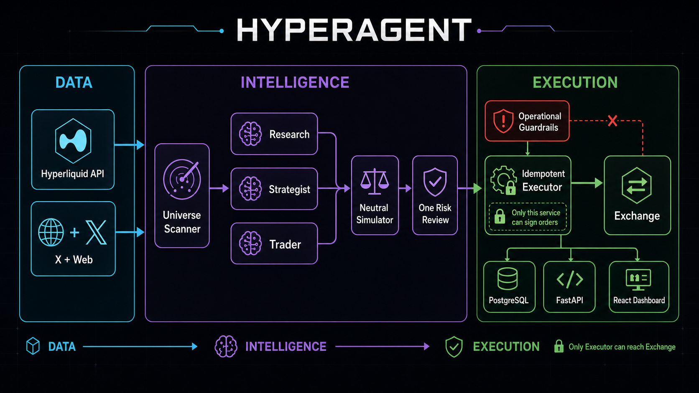
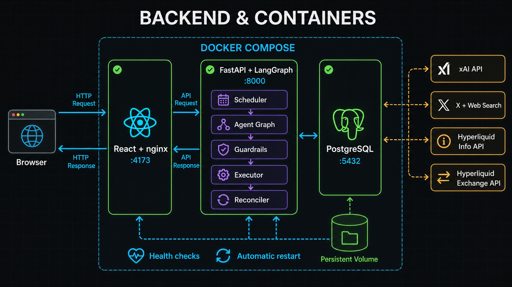
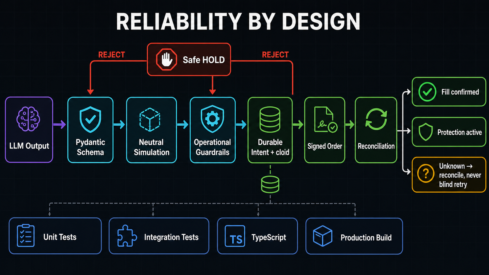

<div align="center">

# HyperAgent

### A stateful multi-agent system connecting LangGraph, xAI and Hyperliquid

Typed decisions · neutral simulation · idempotent execution · real-time observability

</div>



## The idea in 10 seconds

HyperAgent separates **reasoning** from **external side effects**.

- AI agents research, plan, propose and review.
- Deterministic services calculate consequences and validate operations.
- Only one isolated executor can sign an order.
- Every intent, prompt, fill, protection and cost is persisted and visible.

```text
market + web → specialized agents → neutral simulator → operational validation
→ durable intent → signed side effect → exchange reconciliation → dashboard
```

## Multi-agent orchestration

| Agent | Job | Output |
|---|---|---|
| **Research** | Converts untrusted X/web content into typed event signals | `ResearchBundle` |
| **Strategist** | Maintains a multi-asset playbook | bias, thesis, levels, invalidation |
| **Trader** | Produces an initial action and explicit allocation | action, notional, leverage, horizon |
| **Risk review** | Reviews neutral consequences exactly once | `KEEP_AS_IS`, `ADJUST`, `CANCEL` |

The agents share a LangGraph state but never receive exchange credentials or an order-submission tool.

## Backend & container topology



The application runs as three Docker Compose services:

- **React + nginx** — operator interface and live visualizations;
- **FastAPI + LangGraph** — scheduling, agent orchestration, validation and execution;
- **PostgreSQL** — cycles, prompts, costs, intents, protections and reconciliation state.

The backend integrates four external surfaces: xAI structured generation, X/web search, Hyperliquid read APIs and the signed Hyperliquid exchange API.

## Reliability by design



Key engineering properties:

- strict Pydantic contracts with unknown fields forbidden;
- fail-closed `HOLD` when an LLM response cannot be parsed;
- neutral consequence calculation before execution;
- deterministic operational guardrails;
- durable intent written before network submission;
- deterministic decision keys and client order IDs (`cloid`);
- ambiguous acknowledgements reconciled instead of blindly retried;
- exchange-side reduce-only stop-loss and take-profit orders;
- actual fills used to reconstruct realized P&L, fees and funding;
- independent kill-switch checks at cycle entry and before execution.

## Dynamic and cost-aware runtime

The market layer scans a wider universe deterministically, ranks assets using liquidity, movement, open interest and spread, then sends only the strongest candidates and existing positions to the agents.

The scheduler wakes frequently without automatically paying for an LLM call. A new analysis is triggered by material price movement, fills, protection events, available capital or a maximum elapsed interval. Research and strategist results are cached independently.

## Operator dashboard

The UI exposes the internal work of the system instead of hiding it:

- proposal → consequence report → final review;
- prompt, response, latency, tokens and estimated API cost;
- selected and rejected universe candidates with ranking reasons;
- OHLCV position charts with entry, TP, SL and actual fill markers;
- realized/unrealized P&L, funding, fees and API costs;
- signed intents, exchange protections and reconciliation status;
- automation state, available cash and emergency controls.

## Stack

<div align="center">

| Orchestration | Backend | AI & data | Execution | Frontend | Runtime |
|---|---|---|---|---|---|
| LangGraph | FastAPI | xAI | Hyperliquid SDK | React 19 | Docker Compose |
| Python 3.13 | Pydantic v2 | X Search | Info API | TypeScript | nginx |
| Stateful graph | SQLAlchemy | Web Search | `cloid` reconciliation | Lightweight Charts | PostgreSQL |

</div>

## Code map

```text
agent/graph.py                    LangGraph state machine
agent/decision.py                 strategist, trader and final review
agent/research.py                 isolated X/web research boundary
agent/consequence.py              neutral deterministic simulator
agent/guardrails.py               operational validation
agent/hyperliquid.py              market/account read layer
agent/hyperliquid_execution.py    signed execution and reconciliation
agent/scheduler.py                event-driven autonomous cadence
frontend/src/                     operator dashboard
tests/                            reliability and integration coverage
```

## Validation

`pytest` integration suite · 47 historical LLM checks · TypeScript typecheck · Vite production build

The tests cover schema rejection, contextual validation, sizing, duplicate prevention, partial fills, lost acknowledgements, protective orders, cost observability and autonomous scheduling.

---

<div align="center">

**Engineering showcase, not investment advice.** Paper mode is the safe default; signed modes require explicit configuration and dedicated credentials.

[Detailed architecture](docs/m0/ARCHITECTURE.md) · [Operational gates](docs/m0/GATE.md)

</div>
