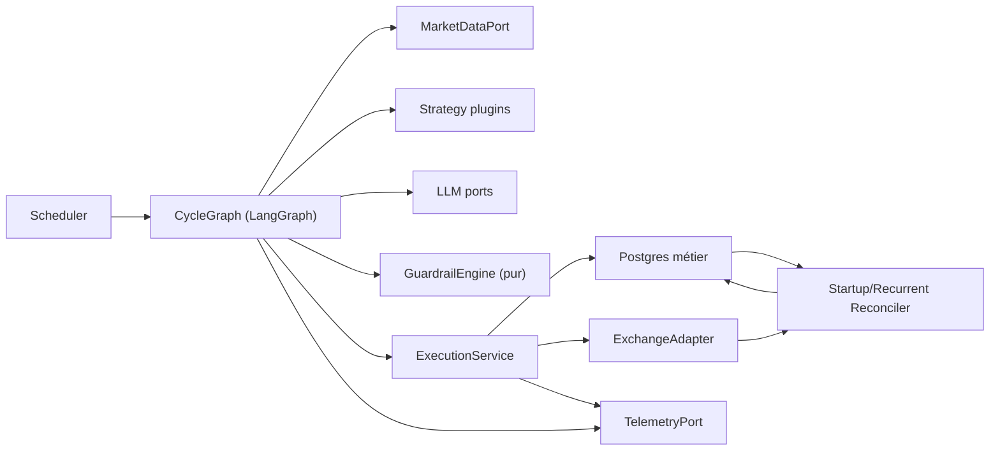
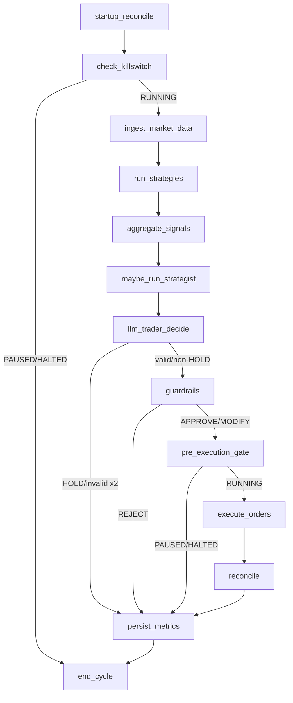

# M0 — Architecture de fiabilité

**Statut : proposition pour gate humain.** Ce document ne donne aucune autorisation
de déploiement. L'état du workspace au moment de l'audit n'est pas exécutable comme
agent de trading.

## 1. Audit de l'entrée

Le workspace ne contient pas le repo privé annoncé dans le plan. Il contient
uniquement :

- les schémas Pydantic et contrôles contextuels de la couche LLM ;
- deux prompts et leur annexe de conception ;
- un runner de 47 contrôles ;
- une archive RAR vide (en-tête seul, 24 octets) ;
- aucun dépôt Git, manifeste de dépendances, CI, package Python, graphe LangGraph,
  adaptateur Hyperliquid, schéma Postgres ou configuration de déploiement.

Conséquence : les stratégies et l'orchestration « maison » ne peuvent pas être
auditées ou conservées depuis cette entrée. M0 fixe leur frontière d'intégration,
mais leur migration exige le repo source réel.

Le fichier de plan reçu s'arrête au titre `2.3 AgentState`. Les milestones détaillés
et leurs critères d'acceptation ne sont pas présents. Les critères ci-dessous sont
donc des préconditions d'architecture, pas un remplacement silencieux de la partie
manquante du plan.

## 2. Principes retenus

1. **Deux états séparés.** `AgentState` transporte les données éphémères d'un cycle.
   Postgres conserve les faits métier. Un checkpoint ne constitue jamais une preuve
   qu'un ordre a, ou n'a pas, été envoyé.
2. **Un seul port d'effets de bord.** Seul `ExecutionService` peut appeler un
   `ExchangeAdapter`. Les nœuds LLM, stratégies et guardrails restent purs.
3. **At-most-once avant disponibilité.** Après un résultat réseau ambigu, le système
   réconcilie et peut s'arrêter ; il ne fabrique jamais une nouvelle tentative avec
   une nouvelle identité pour « essayer quand même ».
4. **Fail-closed pour l'augmentation du risque.** Une dépendance indisponible, une
   config invalide, des données vieilles, un playbook invalide ou un état inconnu
   interdisent `OPEN`. Les sorties `REDUCE`/`CLOSE` suivent leur chemin dédié.
5. **La configuration effective est immuable par cycle.** Elle est validée au
   démarrage, versionnée et hashée. Le kill-switch, lui, est toujours relu en base et
   n'est jamais pris depuis cette copie.
6. **Aucune valeur de capital dans les prompts.** Des DTO dédiés aux prompts retirent
   equity, notionnel, quantité, levier et PnL ; il ne suffit pas de demander au LLM
   de les ignorer.

## 3. Composants et dépendances



Ports publics stables :

- `Strategy.evaluate(context) -> StrategySignal`, découvert par entry point
  `agent_reliability.strategies` ;
- `MarketDataPort.snapshot() -> FeatureSheet` ;
- `StrategistPort.decide(...) -> PlaybookLLMOutput` et
  `TraderPort.decide(...) -> TraderOutput` ;
- `GuardrailEngine.evaluate(...) -> GuardrailVerdict` ;
- `ExchangeAdapter.submit/query_order/open_orders/fills/positions/cancel` ;
- `KillSwitchRepository.read/transition` ;
- `TelemetryPort` sans droit de modifier la décision.

Une implémentation privée peut fournir des stratégies et un adaptateur existant,
mais ne peut contourner ni les DTO Pydantic, ni les guardrails, ni
`ExecutionService`.

## 4. Graphe et contrats des nœuds



`startup_reconcile` est un prérequis du scheduler, pas seulement un nœud décoratif :
tant qu'il reste un intent non terminal non classé, aucun cycle de décision ne peut
démarrer (I7).

Chaque nœud respecte ces règles :

| Nœud | I/O autorisé | Effet de bord métier | Sortie en erreur |
|---|---|---|---|
| `check_killswitch` | lecture Postgres fraîche | événement de cycle | fin sûre |
| `ingest_market_data` | market-data port | snapshot horodaté/hashé | cycle échoué |
| stratégies/agrégation | aucun après snapshot | aucun | signal absent + incident classé |
| nœuds LLM | provider + trace | playbook/incident persisté via repository | repair unique puis fail-closed |
| `guardrails` | lecture du contexte durable | verdict complet | REJECT |
| `pre_execution_gate` | nouvelle lecture kill-switch | audit du gate | fin sûre |
| `execute_orders` | uniquement `ExecutionService` | intent puis tentative persistés | `UNKNOWN`, jamais nouvel ordre |
| `reconcile` | exchange + Postgres | transitions/fills | circuit/kill-switch selon politique |
| `persist_metrics` | Postgres + télémétrie | résumé du cycle | incident ; jamais de nouvel ordre |

## 5. `AgentState` éphémère

Le state est un `TypedDict` versionné contenant seulement des identifiants et les
valeurs nécessaires au routage du cycle :

```python
class AgentState(TypedDict):
    schema_version: Literal[1]
    cycle_id: UUID
    thread_id: str
    mode: Literal["dry_run", "paper", "testnet", "supervised", "live"]
    started_at: datetime
    config_version: str
    kill_switch_state: Literal["RUNNING", "PAUSED", "HALTED"]
    market_snapshot: FeatureSheet | None
    strategy_signals: list[StrategySignal]
    playbook_id: UUID | None
    trader_output: TraderOutput | None
    guardrail_verdicts: list[GuardrailVerdict]
    approved_orders: list[ApprovedOrder]
    order_intent_ids: list[UUID]
    incidents: list[IncidentRef]
    cycle_status: Literal["RUNNING", "SKIPPED", "FAILED", "COMPLETED"]
```

Interdits dans `AgentState` : clé privée, signature, webhook, vérité des fills,
compteur de nonce, état canonique d'un intent et toute donnée nécessaire à prouver
l'idempotence. `approved_orders` est une proposition ; seul un `order_intent` durable
autorise un effet.

En mode SUPERVISED, l'interrupt est placé après le verdict et avant la création de
l'intent. La reprise revalide la fraîcheur, le kill-switch et l'intégralité des
guardrails ; une approbation humaine n'est jamais une exemption.

## 6. Modèle durable minimal

Toutes les dates sont `timestamptz`, les montants/prix sont `numeric` ou chaînes
décimales à la frontière exchange, jamais des `float` pour la soumission.

| Table | Rôle | Contraintes structurantes |
|---|---|---|
| `cycles` | vie d'un cycle | PK `cycle_id`, statut terminal explicite |
| `market_snapshots` | provenance/fraîcheur | hash unique, `as_of`, payload JSONB |
| `playbooks` | versions validées | unique `(strategy_scope, version)`, hash/prompt/model |
| `guardrail_verdicts` | décision déterministe | unique `(cycle_id, symbol, action)`, config hash |
| `order_intents` | autorisation logique | unique `decision_key`, unique `cloid`, payload canonique |
| `execution_attempts` | transport signé | unique `(signer_id, nonce)`, corps signé immuable |
| `orders` | vue exchange réconciliée | unique `(venue, exchange_order_id)`, unique `cloid` |
| `fills` | faits de remplissage | unique `(venue, trade_id)` |
| `kill_switch_events` | journal append-only | version monotone ; acteur et raison obligatoires |
| `incidents` | erreurs classées | type, retryability, corrélation, résolution |
| `outbox_events` | alertes/traces exportables | unique clé d'événement, retries bornés |
| `nonce_counters` | nonce par signer | une ligne verrouillée par signer |

Les mises à jour métier et l'outbox sont commises dans la même transaction. Une
panne de Langfuse ou du webhook ne rend donc pas l'ordre invisible et ne déclenche
jamais une seconde soumission.

## 7. Protocole d'idempotence I1

Hyperliquid accepte un `cloid` de 128 bits et permet de demander le statut d'un ordre
par `oid` ou `cloid`. Sa documentation impose aussi un nonce jamais réutilisé par
signer dans la fenêtre conservée. Le protocole combine ces deux primitives :

1. Après `APPROVE/MODIFY`, calculer `decision_key` depuis la décision normalisée,
   `cycle_id`, le symbole et la version de guardrails.
2. Dans une transaction, insérer l'intent avec contrainte unique. En cas de conflit,
   retourner l'intent existant : aucune nouvelle soumission.
3. Dériver `cloid = 0x + first_16_bytes(sha256(namespace || intent_id)).hex()`.
4. Allouer sous verrou un nonce monotone pour un wallet API dédié à cet exécuteur.
   Construire, signer et persister le corps canonique **avant** tout appel réseau.
5. Relire le kill-switch directement en base. S'il n'est plus `RUNNING`, marquer
   l'intent annulé avant soumission.
6. Envoyer uniquement le corps signé persisté. Un retry transport réémet exactement
   le même corps, donc le même nonce et le même `cloid` ; il ne reconstruit jamais
   l'ordre.
7. Sur ACK perdu/timeout, passer à `UNKNOWN` et interroger `orderStatus` par `cloid`,
   puis les ordres/fills/positions. Aucun nouvel intent n'est créé.
8. Si l'ambiguïté subsiste au-delà du budget, ouvrir le circuit d'exécution, passer
   le kill-switch selon la politique et exiger une réconciliation/opération humaine.
   La disponibilité est sacrifiée à I1.

Un wallet API est dédié à un seul processus d'exécution et n'est jamais réutilisé
après révocation. Le compteur de nonce est durable. Cette exigence suit les
recommandations officielles Hyperliquid et doit être couverte par des tests de crash
avant/après chaque frontière de transaction.

Références officielles consultées pour M0 :

- [Exchange endpoint — ordre, cloid et cancel-by-cloid](https://hyperliquid.gitbook.io/hyperliquid-docs/for-developers/api/exchange-endpoint)
- [Info endpoint — statut par oid ou cloid](https://hyperliquid.gitbook.io/hyperliquid-docs/for-developers/api/info-endpoint)
- [Nonces and API wallets](https://hyperliquid.gitbook.io/hyperliquid-docs/for-developers/api/nonces-and-api-wallets)

## 8. Kill-switch, erreurs et circuits

États : `RUNNING -> PAUSED -> RUNNING`, `RUNNING|PAUSED -> HALTED`. La sortie de
`HALTED` exige une transition manuelle distincte et une réconciliation verte. Chaque
transition est append-only, authentifiée, raisonnée et alertée.

Deux lectures obligatoires et non cachées : entrée du cycle et juste avant l'appel de
soumission. Une transition postérieure à la seconde lecture ne peut annuler un appel
déjà en vol ; lors de `HALTED`, le runbook réconcilie puis annule les ordres ouverts
selon la politique approuvée.

Classification :

- `RetryableTransportError` : retry borné du même appel idempotent ;
- `RateLimitError` : backoff avec jitter, sans dépasser la deadline de fraîcheur ;
- `ExchangeReject` : terminal pour l'intent, sans retry ;
- `AmbiguousSubmission` : `UNKNOWN`, réconciliation obligatoire ;
- `DataStale`, `SchemaViolation`, `GuardrailReject` : aucune soumission ;
- erreur non classée : cycle `FAILED`, incident, circuit incrémenté.

Les circuits sont séparés (`market_data`, `llm`, `exchange`, `telemetry`). Seul le
circuit de télémétrie peut permettre au cycle de finir, grâce à l'outbox durable ; il
ne peut jamais masquer l'audit local exigé par I5.

## 9. Modes et verrou LIVE

| Mode | Adaptateur d'ordre | Approbation | Données |
|---|---|---|---|
| `DRY_RUN` | aucun ; intent simulé/audité | non | mock ou réelles |
| `PAPER` | exchange déterministe local | non | réelles |
| `TESTNET` | Hyperliquid testnet seulement | non | testnet |
| `SUPERVISED` | venue explicitement configurée | interrupt obligatoire | réelles |
| `LIVE` | Hyperliquid mainnet | non | réelles |

Le démarrage LIVE refuse de construire le graphe sauf si toutes les conditions sont
vraies : `AGENT_MODE=live`, confirmation exacte, guardrails valides et non vides,
DSN Postgres de production, wallet/mainnet cohérents, migrations à jour,
réconciliation verte, kill-switch `RUNNING`, télémétrie/outbox disponibles et aucun
circuit ouvert. Le mode ne peut pas être changé à chaud.

## 10. Observabilité et confidentialité

Chaque cycle, verdict, tentative, transition et réconciliation reçoit un identifiant
de corrélation durable. Langfuse reçoit les tags prévus (`playbook_id`, version,
feature hash, prompt version, mode), plus `cycle_id`, `decision_key`, verdict et
latences. Les clés, signatures, equity, PnL, notionnels et payloads signés sont
supprimés avant export.

Les prompts reçoivent des projections dédiées (`PromptPosition`) composées uniquement
du symbole, côté, prix d'entrée et niveaux. Le modèle `PositionState` métier peut
contenir un notionnel pour le sizing, mais ne doit jamais être sérialisé directement
vers un provider LLM.

## 11. Matrice des invariants

| Invariant | Mécanisme architectural | Test de défaillance exigé |
|---|---|---|
| I1 | intent/decision/cloid uniques + requête signée persistée | timeout, ACK perdu, crash avant/après send, retry concurrent |
| I2 | DTO strict -> checks contextuels -> guardrails -> execution port unique | payload extra/malformé, bypass de nœud, sortie invalide x2 |
| I3 | deux lectures DB non cachées | bascule entre guardrails et send |
| I4 | âge contrôlé au guardrail et revalidé après interrupt/backoff | horloge limite, donnée vieillie pendant attente |
| I5 | tables métier + outbox transactionnelle | Langfuse/webhook/Postgres indisponible |
| I6 | taxonomie explicite + circuits | exception inconnue, répétitions, demi-cycle |
| I7 | barrière startup/reconcile | intents `SUBMITTING`/`UNKNOWN` au redémarrage |

## 12. Ordre d'implémentation après le gate

1. Package, configuration typée, modes et verrou LIVE.
2. Schéma/migrations Postgres, repositories, outbox et kill-switch.
3. Adaptateurs mock/PAPER et protocole d'intent idempotent avec chaos tests.
4. Guardrail engine intégrant la couche LLM existante.
5. Graphe LangGraph, repair/fail-closed et interrupts SUPERVISED.
6. Adaptateur Hyperliquid TESTNET et réconciliation par CLOID (implémenté en v0.2).
7. Langfuse/alerting, métriques et case study sans PnL.

Chaque étape conserve DRY_RUN par défaut. TESTNET, SUPERVISED et LIVE restent des
gates humains séparés.
